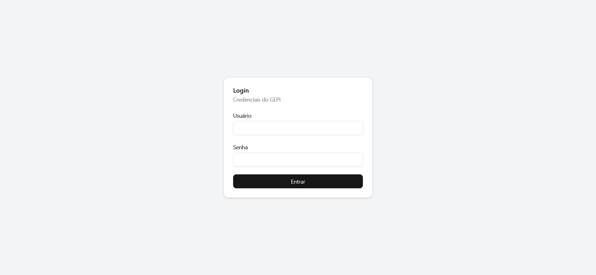
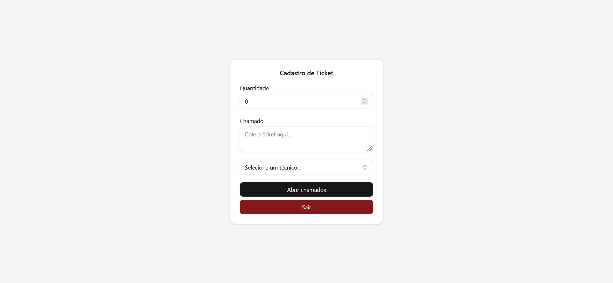

# 📘 glpi_api_consumption

Aplicação web desenvolvida para automatizar a criação de múltiplos chamados idênticos no sistema GLPI da Unimontes.

## 🧾 Descrição

A abertura de chamados repetitivos no GLPI pode ser uma tarefa demorada. Este projeto resolve esse problema ao consumir a API do GLPI diretamente do frontend, permitindo que o usuário crie vários chamados de forma rápida e prática por meio de uma interface amigável.

A aplicação possui autenticação com **usuário e senha**, envia as credenciais à API do GLPI, e utiliza o Token criado para registrar os chamados automaticamente.

## 🖼️ Exemplo da Interface

### Tela de Login



### Tela de Criação de Chamado




## ⚙️ Funcionalidades

- Tela de login com autenticação via **usuário e senha**
- Tela de criação de chamados com:
  - Campo de quantidade de chamados
  - Campo de texto para descrição do chamado
  - Botão para envio
  - Botão para logout
- Integração direta com a API do GLPI da Unimontes
- Feedback visual ao usuário sobre o sucesso ou falha da operação

## 🚀 Tecnologias Utilizadas

- [React](https://reactjs.org/)
- [Vite](https://vitejs.dev/)
- [ShadCN UI](https://ui.shadcn.com/)
- [Tailwind CSS](https://tailwindcss.com/)

## 📦 Instalação

### Pré-requisitos

- Node.js (v18 ou superior)
- URL da API do GLPI

### Passos

```bash
# Clone o repositório
git clone https://github.com/luiz-github/GLPI_API_Consumption

# Acesse o diretório
cd GLPI_API_Consumption

# Instale as dependências
npm install

# Inicie a aplicação
npm run dev
```

### 🔐 Configuração

Crie um arquivo .env na raiz do projeto com a seguinte variável:

```bash
# Adicione a url da API na raiz em um arquivo .env
VITE_API_BASE_URL=https://www.exemple.exemple.br/apirest.php